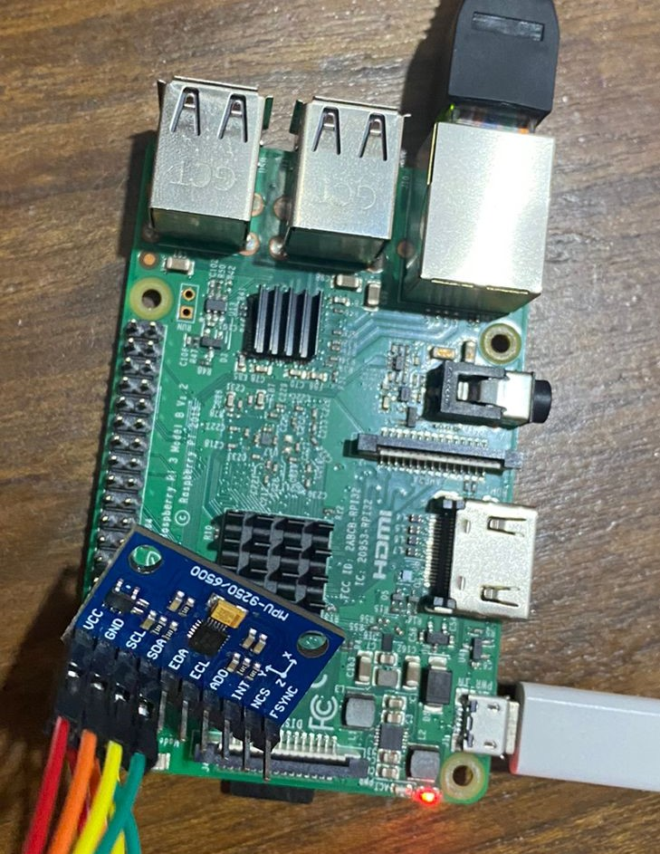

# IMD_2022

El repositorio presenta un driver I2C de linux en una [Raspberry Pi 3 B](https://www.raspberrypi.com/products/raspberry-pi-3-model-b/) para el sensor [MPU6500](https://invensense.tdk.com/products/motion-tracking/6-axis/mpu-6500/).

En la carpeta [drivers](./drivers/) se encuentran por un lado los ejercicios de la práctica de la materia que muestran de forma progresiva las diferentes funciones utilizadas. 

En la carpeta [mpu6500_i2c](./drivers/mpu6500_i2c/) se encuentra el driver desarrollado, Makefile para compilarlo y tres programas diferentes para demostrar el funcionamiento del sistema.

## Conexion
La conexión entre el sensor y la raspberry se realiza utilizando los pines 3 y 5 del I2C y los pines 4 y 6 de alimentación de la raspberry (observar la figura)

 

Para estas pruebas se utilizan los componentes que se ven en la siguiente figura:

 

Para conocer la ejecución del driver se debe leer el [README](./drivers/mpu6500_i2c/README.md)